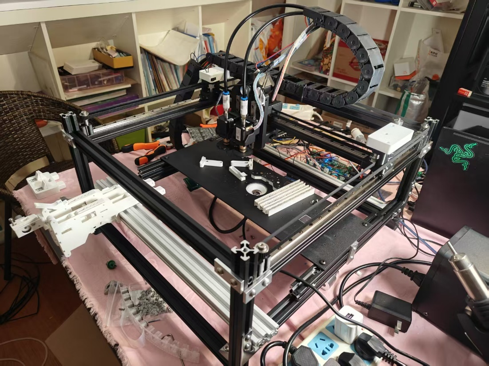
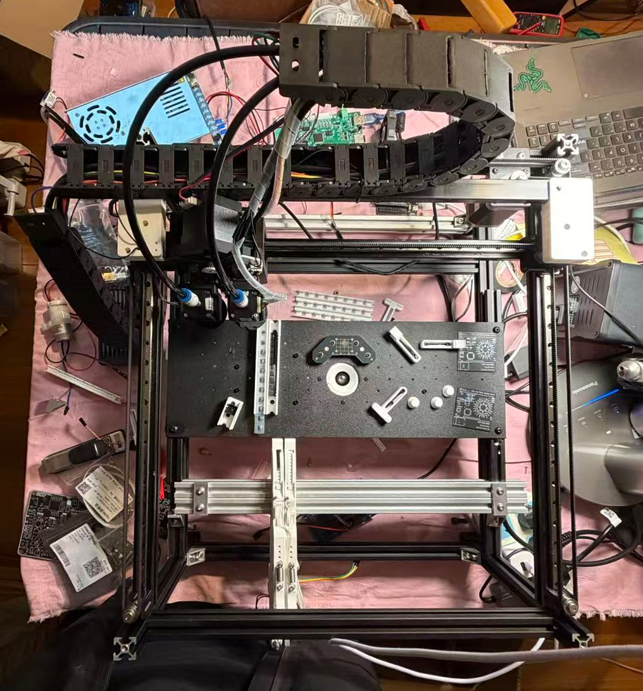
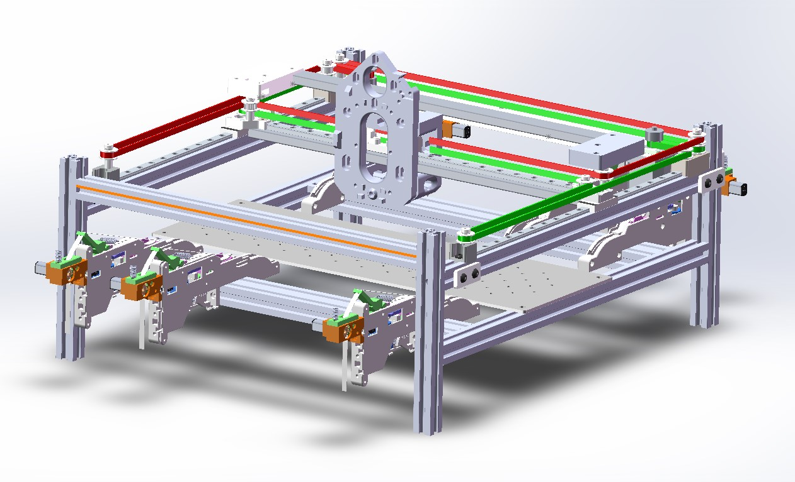
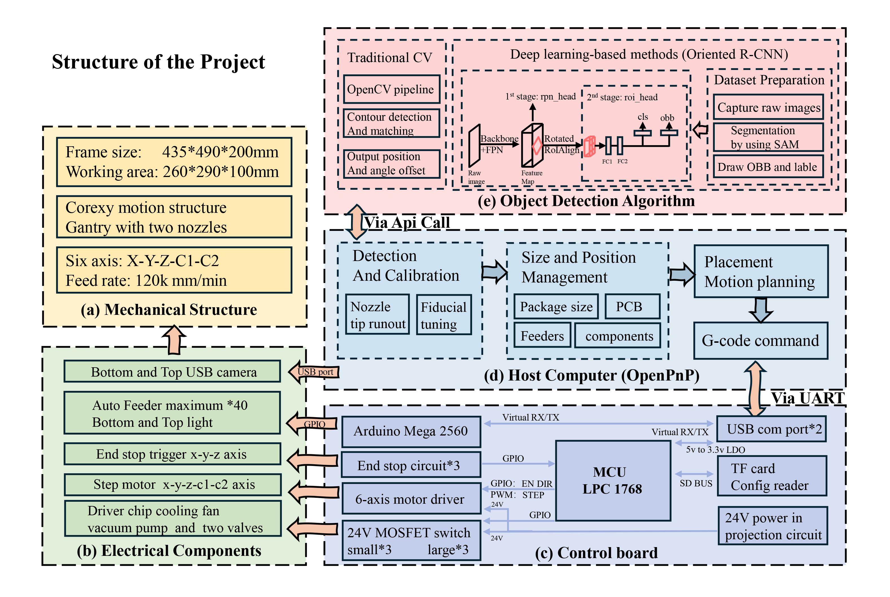

# URFP2025-2026 + ELEC4848 Project

An open-source project for electronic component detection, covering the full pipeline from hardware design to dataset preparation and oriented object detection training.
placement demo: https://youtu.be/beTFyRhgFUg?si=JH4MDpouKkA5vrrt
## Machine

| Machine View | Image |
| --- | --- |
| Full Machine |  |
| Top View |  |
| Frame View |  |

## Structure

This project is organized into hardware design assets, dataset preparation tools, and model training configurations/results.



```text
URFP2025-2026AndELEC4848Proj/
├─ hardware/
│  ├─ corexyframe-v2.easm
│  ├─ controlBoard/
│  └─ testboard/
├─ poster80200/
├─ image/
├─ software/
│  ├─ elec-dataset/
│  │  └─ output/
│  │     ├─ train/
│  │     ├─ val/
│  │     └─ test/
│  ├─ prepare-dataset/
│  │  ├─ step1capture-dataset/
│  │  ├─ step2annotationtool/
│  │  └─ step3annotationtransfer/
│  └─ modeltraining/
├─ LICENSE
└─ README.md
```

## Pipeline Overview

1. Capture images with a USB camera tool.
2. Annotate images with the SAM-based annotation workflow.
3. Convert annotations to DOTA format and split train/val/test.
4. Train oriented object detection models.
5. Evaluate and compare experiment outputs.

## Software Workflow

### Step 1: Image Capture

Path: `software/prepare-dataset/step1capture-dataset`

Main scripts:

- `camera_capture.py`: USB camera capture with manual controls (exposure, white balance, etc.)
- `copy_zero_images.py`: helper script for dataset organization

Example:

```bash
pip install -r software/prepare-dataset/step1capture-dataset/requirements.txt
python software/prepare-dataset/step1capture-dataset/camera_capture.py
```

### Step 2: Annotation

Path: `software/prepare-dataset/step2annotationtool`

Main scripts:

- `segment_anything_annotator.py`: SAM annotation entry
- `helpers/generate_onnx.py`: convert SAM checkpoint to ONNX
- `statistics.sh`: basic statistics script

### Step 3: Annotation Transfer and Split

Path: `software/prepare-dataset/step3annotationtransfer`

Main scripts:

- `convert_yolo_obb_to_dota.py`: YOLO-OBB to DOTA conversion + split
- `duplicate_label_variants.sh`: duplicate label variants

Example:

```bash
python software/prepare-dataset/step3annotationtransfer/convert_yolo_obb_to_dota.py
python software/prepare-dataset/step3annotationtransfer/convert_yolo_obb_to_dota.py --split-ratios 0.8,0.1,0.1
```

Default split ratio: `train/val/test = 0.7/0.15/0.15`

### Model Training

Path: `software/modeltraining`

Included configurations:

- `oriented_rcnn_dotav3/oriented_rcnn_r50_fpn_1x_dota_custom_optv3.py`
- `oriented_reppoints_dotav2/oriented_reppoints_r50_fpn_40e_dota_ms_le135_custom.py`
- `roi_trans_dotav2/roi_trans_r50_fpn_fp16_1x_dota_le90_custom.py`

## License

This project is licensed under the MIT License. See the `LICENSE` file for details.

## Acknowledgements

Thanks to the following open-source projects and communities:

| Project | Logo |
| --- | --- |
| OpenPnP |  |
| Opulo |  |
| OSHW-Smoothieware |  |
| MMRotate |  |
